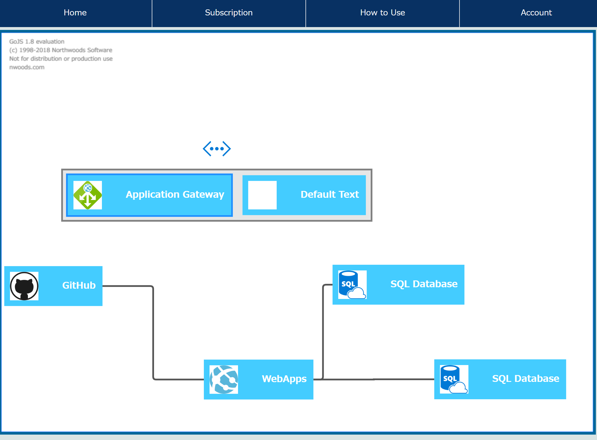

visuazure
====

This web application enables azure users to visualize the connections among resources. 

## Description
In the Azure portal, it is sometimes troublesome to understand how each resource connect to others in Microsoft Azure.
By using this app, you can get a straightforward view of your resource group like below. The data used is fetched from Azure management. For the front end, GoJs, which is a Javascript framework, is used to visualize it.

## DEMO
     
In this case, you can easily understand webapp is deployed from Github and has some data connection with two SQL databases. Moreover, the subnets and gateways are also visualized. 

## Requirement
- [Python 3+](https://www.python.org/downloads/release/python-364/)
- [Flask](http://flask.pocoo.org/)
- [ADAL Python](https://github.com/AzureAD/azure-activedirectory-library-for-python#install) 
- [An Azure AD tenant](https://azure.microsoft.com/en-us/documentation/articles/active-directory-howto-tenant/)
- [An Azure AD user](https://docs.microsoft.com/en-us/azure/active-directory/add-users-azure-active-directory). Note: this sample does not support Microsoft accounts. 

## Future Improvement
This app is under development. Following features should be added. ANY pull requests are welcome.
- UI improvement 
    - Home page
    - How to Use page
- Processing speed 
- Resources that can be displayed    
Current supported resource are VM, Vnet, Webapps, SQL database, Load balancer, and Storage.
- Detail change on each resource

## Reference
https://github.com/Azure-Samples/active-directory-python-webapp-graphapi